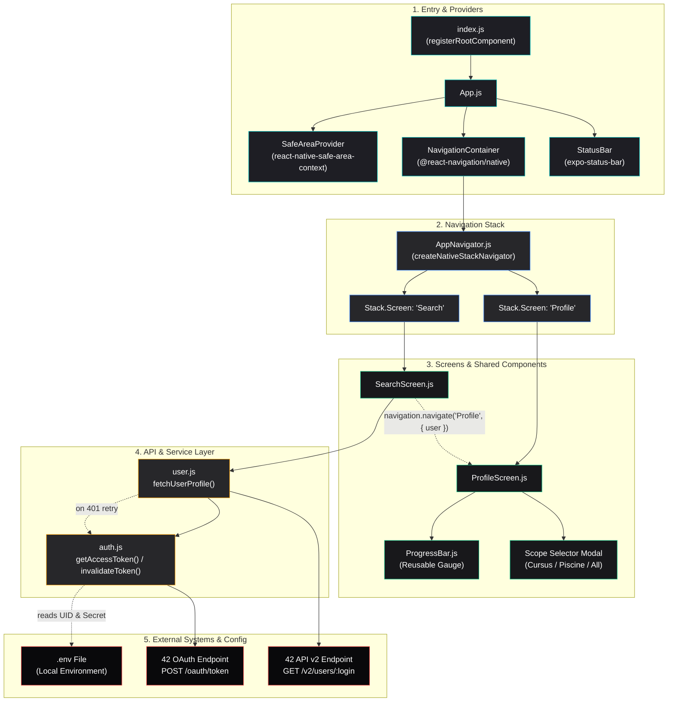

# Component Architecture & Relationships

This document outlines the software architecture of the **Swifty Companion** application. It details the purpose and responsibilities of each module, component, and service, followed by visual diagrams illustrating their architectural relationships and data flow.

## Architectural Overview

The application follows a modular, layer-oriented architecture commonly used in React Native and Expo applications:

- **Entry & Providers Layer**: Bootstraps the application runtime, context providers, safe-area boundary, and status bar.
- **Navigation Layer**: Manages screen routing, native transition animations, and stack history.
- **Presentation Layer (Screens & Components)**: Handles user interaction, local UI state, data visualisation, and modular subviews.
- **Service & Networking Layer**: Encapsulates 42 Intranet OAuth2 token management, user data fetching, error normalisation, and reactive retry mechanics.
- **Configuration & External Layer**: Manages local `.env` secrets and handles communications with the 42 API v2 REST endpoints.

## Component Directory & Purpose

### Application Entry Points

#### `index.js`
* **Purpose:** The root registration point for Expo.
* **Responsibilities:**
  * Imports the main `App` component.
  * Calls `registerRootComponent(App)` to initialise the React Native bridge and ensure proper packaging across Android, iOS, and Web platforms.

#### `App.js`
* **Purpose:** Top-level React component responsible for global providers.
* **Responsibilities:**
  * Wraps the application hierarchy in `<SafeAreaProvider>` from `react-native-safe-area-context` to safely handle device notches, camera cutouts, and bottom navigation bars.
  * Mounts `<NavigationContainer>` from `@react-navigation/native` to establish the root navigation context.
  * Injects the global `<StatusBar style="light" />` for dark theme consistency.
  * Renders `AppNavigator`.

### Navigation Layer (`src/navigation/`)

#### `AppNavigator.js`
* **Purpose:** Manages application routing and stack-based transitions.
* **Responsibilities:**
  * Uses `createNativeStackNavigator()` to instantiate a hardware-accelerated screen stack.
  * Registers two primary routes:
    * `"Search"`: Root screen hosting `SearchScreen`.
    * `"Profile"`: Detail screen hosting `ProfileScreen`.
  * Enforces unified dark-theme styling across screen headers (`#18181b` background, `#00babc` tint).
  * Dynamically binds the profile header title to the inspected user's login (`route.params?.user?.login`).
  * Enables native platform navigation behaviours (hardware back button on Android, edge-swipe gesture on iOS, and header back button).

### Screen Components (`src/screens/`)

#### `SearchScreen.js`
* **Purpose:** The primary user landing screen providing student lookup functionality.
* **Responsibilities:**
  * **Input Management:** Captures student usernames via a customised `TextInput` with autocapitalization disabled.
  * **Input Validation:** Prevents blank submissions and renders user feedback (`"Please enter a 42 login to search"`).
  * **Asynchronous Orchestration:** Dispatches network queries to `fetchUserProfile(login)` while triggering an `ActivityIndicator` loading state and dismissing the software keyboard.
  * **Error Handling:** Catches API exceptions (404 Not Found, network timeout, disconnection) and renders styled error alerts directly in the UI.
  * **Navigation Dispatch:** On successful retrieval, navigates to the `"Profile"` route, injecting the user JSON payload into route parameters.

#### `ProfileScreen.js`
* **Purpose:** Comprehensive student portfolio and academic dashboard.
* **Responsibilities:**
  * **Header Profile Card:** Displays avatar (`user.image?.link` with placeholder fallback), full display name, and `@login` handle.
  * **Student Details Matrix:** Renders essential metrics fulfilling subject criteria:
    * ₳ Wallet balance (`user.wallet`)
    * Evaluation points (`user.correction_point`)
    * Workstation desk location (`user.location`)
  * **Curriculum Level Progress:** Extracts the primary cursus (prioritising `42cursus`), calculates fractional progress towards the next level, and renders an animated gauge with level and percentage text.
  * **Technical Skills Visualisation:** Iterates through `cursusUser.skills`, normalises skill mastery against maximum rank (level 21), and renders dual-metric progress bars with explicit percentage values.
  * **Projects Portfolio:**
    * Filters root projects to exclude internal exam sessions (`!p.project?.parent_id`).
    * Implements an intelligent scope selector modal with three options: `"Cursus Projects"`, `"Piscine Projects"`, and `"All Projects"`.
    * Automatically falls back to Piscine view if the inspected student has no Cursus projects.
    * Colour-codes project results (Cyan for validated, Magenta for failed/mark 0, Yellow for in-progress).
    * Implements null-safe property access during sorting and rendering to prevent crashes.

### Reusable UI Components (`src/components/`)

#### `ProgressBar.js`
* **Purpose:** A modular, theme-compliant visual gauge component used across user levels and technical skills.
* **Responsibilities:**
  * **Props Accepted:**
    * `label` *(string)*: The skill name or level label displayed on the left.
    * `percentage` *(number)*: Value between 0 and 100 clamped automatically to govern fill width.
    * `valueText` *(string)*: Formatted metric string displayed on the right (e.g., `lvl 8.42 (40%)`).
  * **Layout:** Renders an upper text row followed by a rounded dark track (`#27272a`) containing an animated filled view (`#00babc`).

### API & Service Layer (`src/api/`)

#### `auth.js`
* **Purpose:** OAuth2 client credentials token provider for 42 Intranet API access.
* **Responsibilities:**
  * **Token Caching:** Stores `cachedToken` in memory along with an absolute `tokenExpiresAt` timestamp to prevent creating tokens per query (satisfying Chapter V.1).
  * **Time-Based Expiration:** Validates token age against a 60-second safety window before requesting a new token.
  * **Credential Ingestion:** Ingests `EXPO_PUBLIC_FT_CLIENT_ID` and `EXPO_PUBLIC_FT_CLIENT_SECRET` from environment variables.
  * **Token Invalidation:** Exports `invalidateToken()` to allow downstream services to clear stale credentials upon server rejection (satisfying Chapter V.2 bonus).

#### `user.js`
* **Purpose:** 42 Intra API v2 student data service.
* **Responsibilities:**
  * Sanitizes search queries (`trim().toLowerCase()`) and performs URI encoding.
  * Queries `https://api.intra.42.fr/v2/users/:login` with Bearer token authentication.
  * **Status Normalization:** Maps HTTP 404 responses to `"User '<login>' not found"`.
  * **Network Resilience:** Catches network connection drops and returns clear, human-readable error messages.
  * **Reactive Token Refresh (Bonus):** If the API returns `401 Unauthorized`, automatically calls `invalidateToken()` and transparently retries the query once with a freshly negotiated token.

## Architecture & Component Relationships Diagram

The following Mermaid graph visualises how components, navigation stacks, shared UI elements, and API services connect:

## 4. End-to-End Search & Data Flow

The sequence below illustrates the runtime interaction between components during a search request:

```mermaid
sequenceDiagram
    autonumber
    actor Student as User
    participant Search as SearchScreen
    participant UserSvc as user.js
    participant AuthSvc as auth.js
    participant API as 42 Intranet API
    participant Profile as ProfileScreen

    Student->>Search: Enter login and tap "Search"
    Search->>Search: Validate input & show spinner
    Search->>UserSvc: fetchUserProfile(login)
    
    UserSvc->>AuthSvc: getAccessToken()
    alt Token valid in cache
        AuthSvc-->>UserSvc: cachedToken
    else Token missing or expired
        AuthSvc->>API: POST /oauth/token (credentials)
        API-->>AuthSvc: { access_token, expires_in }
        AuthSvc-->>UserSvc: fresh token
    end

    UserSvc->>API: GET /v2/users/:login (Bearer token)
    
    alt HTTP 200 OK
        API-->>UserSvc: User Profile JSON
        UserSvc-->>Search: userData
        Search->>Profile: navigation.navigate('Profile', { user: userData })
        Profile->>Student: Render Avatar, Stats, Skills & Projects
    else HTTP 401 Unauthorized (Expired)
        API-->>UserSvc: 401 Unauthorized
        UserSvc->>AuthSvc: invalidateToken()
        UserSvc->>AuthSvc: getAccessToken() (forced fresh token)
        AuthSvc->>API: POST /oauth/token
        API-->>AuthSvc: new token
        UserSvc->>API: Retry GET /v2/users/:login
        API-->>UserSvc: User Profile JSON
        UserSvc-->>Search: userData
        Search->>Profile: navigation.navigate('Profile', { user: userData })
    else HTTP 404 Not Found
        API-->>UserSvc: 404 Not Found
        UserSvc-->>Search: Error("User not found")
        Search->>Student: Display error banner
    end
```

