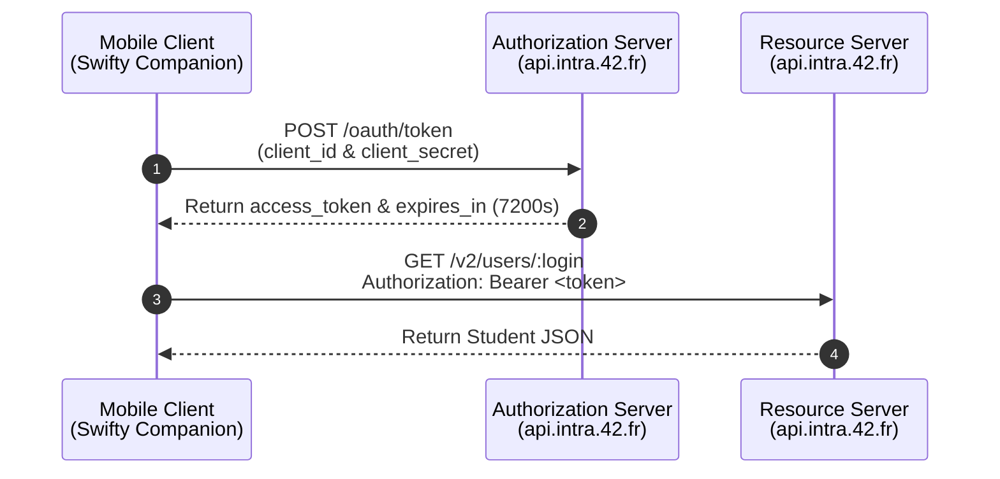

# Protocol Engineering & Security: OAuth 2.0

This document covers the authorization theory, protocol mechanics, and credential security practices implemented in **Swifty Companion** pursuant to **RFC 6749** and the 42 API specifications.

## Delegated Authorization vs. Direct Authentication

### The Inherent Security Flaw of Direct Credentials
In legacy systems, client applications frequently collected and stored long-lived user passwords, sending them over the network with every query. This introduced catastrophic vulnerabilities:
* If client application memory or storage is compromised, user master credentials are leaked.
* Revoking client access required the user to change their master account password.
* The client possessed unbounded, full permissions over the user's account.

### The OAuth 2.0 Solution (RFC 6749)
OAuth 2.0 is a **delegated authorization framework**. Instead of exposing master credentials, clients authenticate to an **Authorization Server** to obtain a scoped, short-lived **Bearer Token**.

The token represents a capability key: possession of the token authorizes the client to make requests to the **Resource Server** (`api.intra.42.fr`) without ever seeing or transmitting user passwords.

## The Client Credentials Grant Flow

### Machine-to-Machine Architecture
OAuth 2.0 specifies several grant flows (Authorization Code, Implicit, Client Credentials, Refresh Token).

Because Swifty Companion queries public/peer directory information without impersonating a specific logged-in student, it utilizes the **Client Credentials Grant** (`grant_type: "client_credentials"`).



### Token Acquisition Implementation
In [`src/api/auth.js`](src/api/auth.js):

```javascript
const response = await fetch(TOKEN_URL, {
  method: 'POST',
  headers: { 'Content-Type': 'application/json' },
  body: JSON.stringify({
    grant_type: 'client_credentials',
    client_id: clientId,
    client_secret: clientSecret,
  }),
});
```

## Token Lifecycle & Cache Optimization

### Why Creating a Token Per Query is Anti-Pattern
Every call to `/oauth/token` requires:
* DNS resolution and TLS handshake overhead.
* Cryptographic signature generation and database writes on the 42 OAuth server.
* Exceeding the strict rate-limits (e.g. 2 requests per second) enforced by 42 Intra.

The subject explicitly forbids creating tokens per query:
> *"Do not create a token for each query. Refer to the OAuth2 documentation."*

Such restriction is due to several critical architectural, performance, and security reasons:
- **Strict Rate Limiting (429 Too Many Requests):** The 42 API enforces strict rate limits (typically 2 requests per second and fixed hourly caps per application). Generating a new token on every search immediately doubles your API calls (1 token request + 1 data query), which exhausts application quotas twice as fast and quickly triggers rate-limiting blocks.
- **Heavy Backend Overhead on the Auth Server:** Token issuance is a cryptographically expensive operation. Generating an access token requires the authorization server to validate client credentials, run hashing operations, generate entropy, issue database/cache writes, and sign the payload. Flooding `/oauth/token` on every user interaction degrades authentication infrastructure.
- **Violating the OAuth 2.0 Specification & Design:** Access tokens are explicitly designed with a lifespan, represented by the `expires_in` attribute returned by `/oauth/token` (typically 7,200 seconds / 2 hours). The OAuth 2.0 standard specifies that client applications must reuse and cache the active token until its expiration window draws near rather than treating the auth endpoint as an API gateway proxy.
- **Client Latency & Mobile UI Performance:** Requesting a new token introduces a synchronous network round-trip before every single profile lookup. Caching the token eliminates an unnecessary round-trip across mobile networks, cutting query response times significantly.

### In-Memory Caching with Safety Window
In [`src/api/auth.js`](src/api/auth.js), Swifty Companion stores the active token and its expiration timestamp:

```javascript
let cachedToken = null;
let tokenExpiresAt = 0;

export async function getAccessToken() {
  const now = Date.now() / 1000;
  if (cachedToken && now < tokenExpiresAt - 60) {
    return cachedToken; // Reuse cached token
  }
  // ... fetch new token ...
  cachedToken = data.access_token;
  tokenExpiresAt = (Date.now() / 1000) + data.expires_in;
  return cachedToken;
}
```
The `now < tokenExpiresAt - 60` logic provides a **60-second safety window**, accounting for clock skew or network latency and preventing in-flight expiration.

## Proactive vs. Reactive Token Renewal (The Bonus)

### Proactive Renewal (Time-Based)
As long as the application remains running, `getAccessToken()` automatically checks token expiration before issuing requests. Once the token has less than 60 seconds remaining, it silently fetches a replacement.

### Reactive Renewal (Server-Driven / 401 Interception)
If the 42 server prematurely revokes the token or resets authentication sessions, a locally cached token will produce an `HTTP 401 Unauthorized` status.

To satisfy the subject's bonus requirement (*"If the token expires, the application must refresh it. The application must still be able to work properly in any case"*), Swifty Companion implements **reactive invalidation and retry**:

In [`src/api/auth.js`](src/api/auth.js):
```javascript
export function invalidateToken() {
  cachedToken = null;
  tokenExpiresAt = 0;
}
```

In [`src/api/user.js`](src/api/user.js):
```javascript
if (response.status === 401 && !isRetry) {
  invalidateToken(); // Purge invalid token
  return fetchUserProfile(login, true); // Automatically retry once with fresh token
}
```
This ensures the application never fails from expired credentials.

## Secrets Management & Configuration Hygiene

### The Twelve-Factor App Methodology
Modern software engineering follows the **Twelve-Factor App** guideline: *Strictly separate configuration from code*. Credentials should never be committed into source control.

### Git Isolation
In Swifty Companion:
* [.env.example](/.env.example) is committed with placeholder values (`your_42_api_uid_here`).
* [.gitignore](/.gitignore) explicitly ignores `.env`, `*.env`, and certificate files.
* Secrets are loaded at runtime through `process.env`.
* A Makefile rule (`make env`) creates local `.env` files safely without exposing credentials.

## Relevance to Subject Requirements

| Subject Requirement | Theoretical Concept Applied |
| :--- | :--- |
| **"Credentials saved locally in a .env file and ignored by git"** | Twelve-Factor configuration isolation, `.gitignore` filtering. |
| **"Do not create a token for each query"** | In-memory token caching with temporal validity verification. |
| **"Bonus: Recreate token at expiration date"** | Dual renewal strategy: Proactive temporal buffer (60s) + Reactive 401 invalidation and retry. |
| **"You must use intra oauth2"** | Implementation of RFC 6749 Client Credentials flow against `https://api.intra.42.fr/oauth/token`. |
